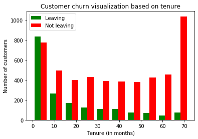
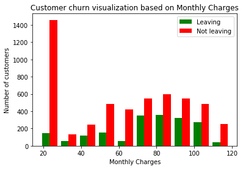
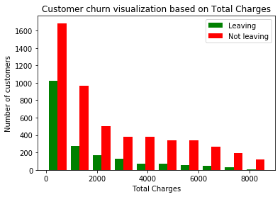
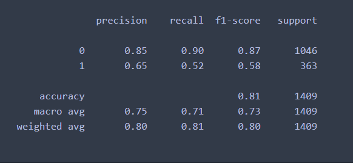
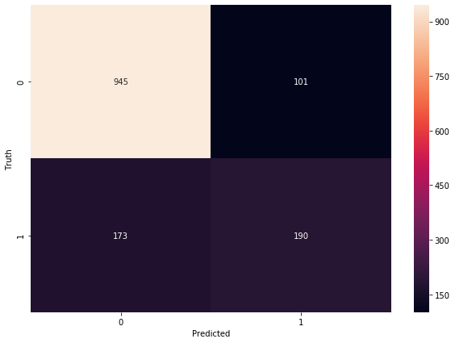

# Customer churn prediction using Artificial Neural Network (ANN)

# Objective

To determine and predict whether a customer would be quit taking services in this case a internet service
Customer data such as this consists of both catergorical and continuous features.
# Visualizing the data

Using Pandas to import data and then with library such as Matpotlib can be eomployed to have a visual representation of the data points.

* We can observe that newer customers tend to leave more.
* Longer the stay duration, less likely they quit the services.

* Mid to high end range customers tend to have a higher leaving rate

* Higher the total charge, lower the leaving rate of customers

# Preprocessing the data

This includes-

* Checking and dealing with redundant values and columns
* Scaling the data. Scaled data helping the machine learning algorithm to work better.

# Model Building

In this project we have applied the concept of Artificial Neural Network - a branch of Deep Learning

* Arficial Neural Network

An artificial neural network (ANN) is the piece of a computing system designed to simulate the way the human brain analyzes and processes information. 
It is the foundation of artificial intelligence (AI) and solves problems that would prove impossible or difficult by human or statistical standards.

In this project we employ KERAS

Keras is an open-source library that provides a Python interface for artificial neural networks. Keras acts as an interface for the TensorFlow library. 

After preprocessing and scaling the data, it is split in Training and Test set for the model to make prediction

# Result

We arrive at a result of accuracy reaching 81%

Best way to understand visually how the model performed we got to look at confusion matrix and with seaborn library we can make it even more appealing

